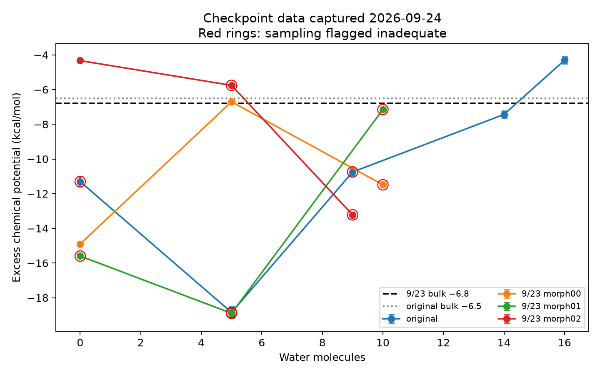

# Screening comparison, captured September 24, 2026

The September 23 spread is not yet a reliable equilibrium morphology effect. Independent packings contribute, but dry-state drift, poorly sampled FEP states, and changed protocol confound the comparison. None of the September 23 branches has a completed result.json or a campaign endpoint summary in this capture. The original reports 16 waters, lambda 1.6, 7.09 wt%; that first-crossing endpoint should not be treated as a validated reference.

Source: each run's uptake_state.json, dry/convergence.json, run_config.yaml, and iter_*/fep/morph00/morphology.json. checkpoint_capture.json freezes the state used here because these directories may still change. CSVs are stale: morph00's CSV describes a different earlier sequence, while morph01 has no CSV.

| Cell | Dry baseline μex (kcal/mol) | μex at 5 waters | Latest water count | Latest μex | Dry density drift (g/cm³ per 100 ps) |
|---|---:|---:|---:|---:|---:|
| Original | −11.305 | −18.849 | 16 | −4.302 | −0.00425 |
| 9/23 morph00 | −14.901 | −6.700 | 10 | −11.487 | −0.00425 |
| 9/23 morph01 | −15.596 | −18.897 | 10 | −7.147 | −0.00102 |
| 9/23 morph02 | −4.327 | −5.754 | 9 | −13.222 | −0.00425 |

The original and morph00 dry.data files are byte-identical. Their dry chemical potentials nevertheless differ by 3.595 kcal/mol. Thus even holding the starting morphology fixed does not reproduce the estimate under these changed FEP settings. Sorting dry atoms by ID also confirms identical charges across all three September 23 cells: different atomic charges are not the explanation here.

The dry baseline spread is 11.269 kcal/mol. Almost all of it is electrostatic: the LJ leg is 0.496, 0.338, 0.239 kcal/mol for morph00/01/02, whereas the Coulomb leg is −15.396, −15.934, −4.566. This is consistent with different sampled ion/water environments or trapping in local environments; the current outputs do not establish which microscopic mechanism dominates. The cell is small: two chains of five units, ten ionic groups, and roughly an 18 Å box. One water changes lambda by 0.1 and uptake by 0.443 wt%, making local-environment and finite-size effects consequential.

The reported small FEP errors do not measure uncertainty from unsampled environments. Specific warning signs are already recorded: morph01 at five waters has only 5–89 decorrelated samples per LJ state (several below the configured minimum 50); morph00 at ten waters has minimum LJ overlap 0.0056, morph01 at ten has 0.0061, and morph02 at nine has 0.0043, all below the required 0.03. All three latest rows flag sampling_adequate=false. Crossings reverse: morph00 crosses at five waters and returns below bulk at ten; morph02 starts above bulk but drops far below it after hydration. These are not three established saturation endpoints.

Morph00 and morph02 fail the saved drift tolerance 0.002. Their negative slopes mean expansion/decreasing density, not continuing densification. Only morph01 passes. The existing obtain_dry_membrane reuse path accepts dry.data without rechecking convergence; a failed preparation can leave dry.data behind for a later resume to reuse. The new snapshot campaign explicitly requires the shared convergence record to pass before releasing any seed. A density tolerance of 50% in these run configurations is also too loose to establish density accuracy by itself.

Protocol differences: original bulk reference −6.5 versus −6.8 kcal/mol; hydrated relaxation 200 versus 400 ps; FEP 8+5 versus 11+11 lambda states; state equilibration 10 versus 50 ps; production 100 versus 500 ps; sample spacing 1 versus 0.5 ps; insertion batches originally effectively five waters versus five in the current checkpoints; the September 23 configuration requests two additional iterations after a crossing. These prevent attributing the changed result solely to morphology. A denser lambda ladder improves one sampling dimension, but does not prove local-environment equilibration.

# Snapshot protocol implemented

The campaign now defaults to one shared dry morphology. Step 21 is at least snapshot_window_ps + 1000 ps (default 3000 ps); longer requested durations are preserved. For three seeds, complete data files are written at 1000, 2000, and 3000 ps of that stage. The same NPT fix persists across the writes. Each data file includes its own coordinates, box, topology and coefficients. The typed chain is shared, and hydration branches use distinct insertion seeds. snapshot_source.json and dry_snapshot_manifest.json record times and SHA-256 provenance. Existing independent campaigns are rejected in snapshot mode rather than silently mixed or overwritten; use a new workdir. Legacy campaigns can explicitly select equilibration.campaign_seeding: independent.

A final 2 ns window makes sense as an initial controlled within-morphology comparison, provided the dry stage is stationary. It is not evidence that the snapshots are independent, or that a glassy polymer has explored all relevant structures. Three seeds span that window at 1 ns intervals; more seeds shorten the spacing. Check autocorrelation of density/energy and structural observables such as ion coordination and cavity statistics, plus block stationarity, before calling the spacing sufficient. PyMBAR documents estimating statistical inefficiency and subsampling correlated time series: https://pymbar.readthedocs.io/en/4.0.0/timeseries.html . Density stationarity alone cannot validate slow structural relaxation.

Accordingly, snapshot campaigns report the mean and descriptive spread but withhold an independence-based standard error/95% interval. The naive SEM is retained only as a labeled diagnostic. This protocol controls packing differences; it cannot establish between-packing uncertainty or repair inadequate FEP sampling. No production simulation was launched and the historical runs were not modified.

# Validation

Focused campaign, snapshot, configuration, CLI, equilibration and template tests passed. A short actual LAMMPS run of the new template produced three complete data files at steps 22, 24 and 26 (20 shortened preparation steps followed by the three equally spaced writes), with successful exit. This verifies the output mechanics, not physical convergence of a 3 ns production preparation. The existing LJ FEP smoke input also ran successfully outside the sandbox; the broad in-sandbox suite encountered LAMMPS startup failures before log creation.
